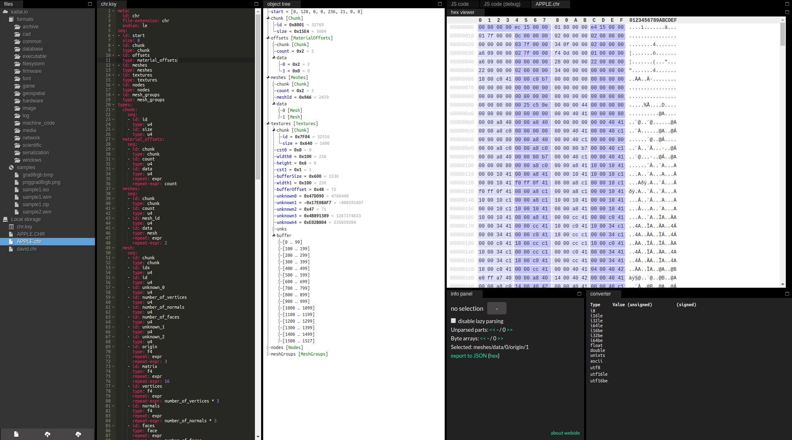

I created a kaitai struct for .chr files in silver. You can find the code [here](https://github.com/maluramichael/silvie/blob/master/kaitai/chr.ksy).

Thanks to [othias](https://github.com/othias), he created the initial file parser.
